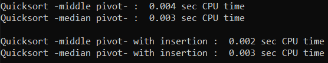

# quicksort-cpu-time
A program that measures CPU time of four different types of quicksort algorithm.

## Information

Quicksort algorithm with: 

(1) middle pivot element\
(2) median pivot element\
(3) middle pivot element and insertion sort\
(4) median pivot element and insertion sort

